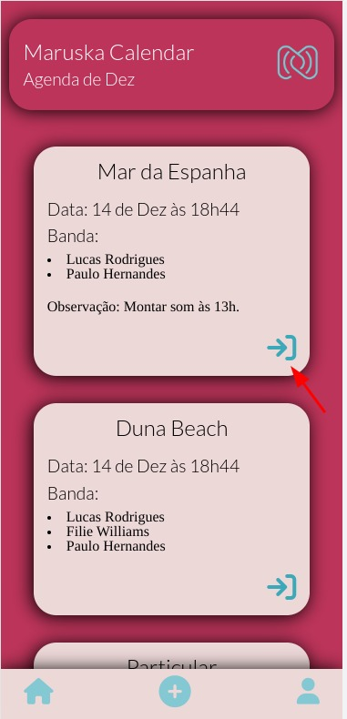
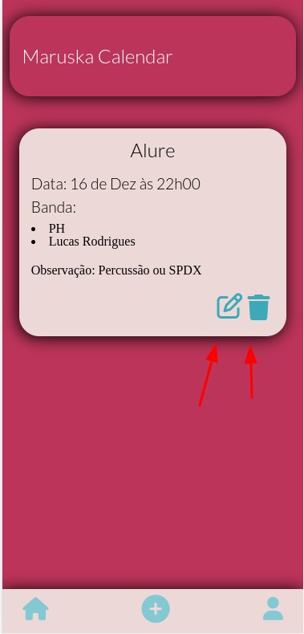
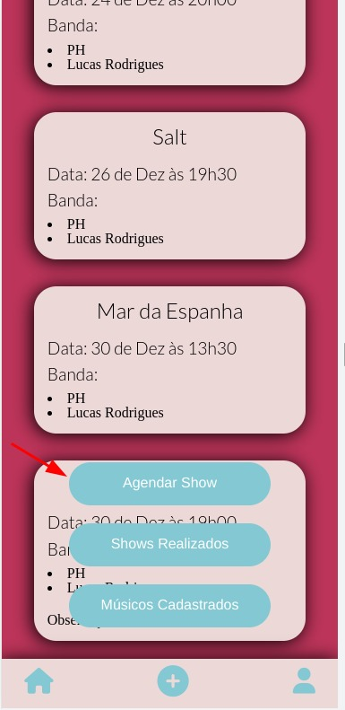
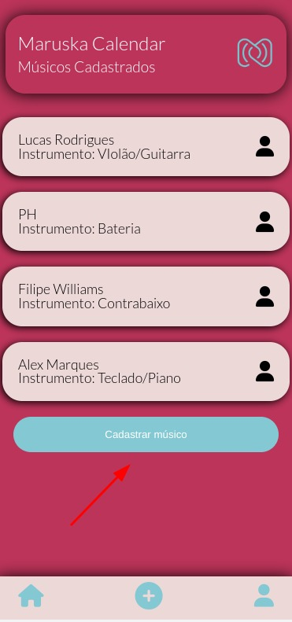
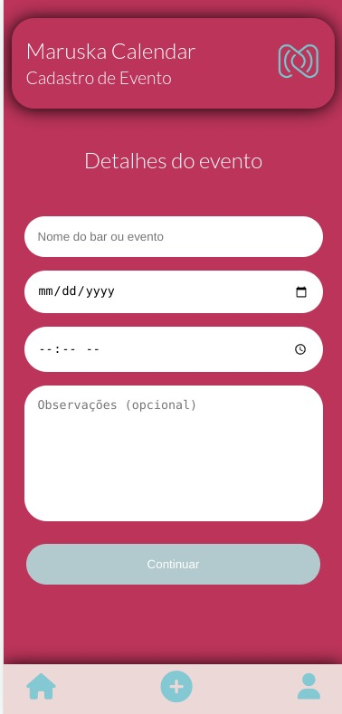
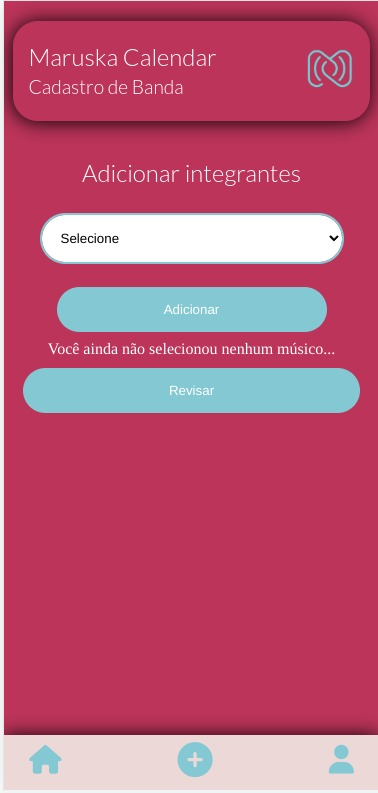
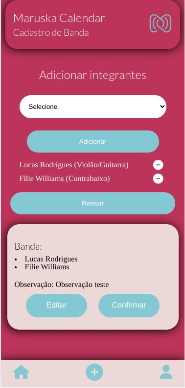

# Maruska Calendar

Aplicação no estilo "todo list" para agendamento de shows para a cantora Maruska.

## Funcionalidades

- A aplicação permite que o usuário crie uma conta e visualize todos os shows agendados, contendo informações como endereço, data, hora e campo para observações.

- Na aba de perfil é possível editar o nome e email de usuário, bem como excluir sua conta e realizar o logout.

## Funcionalidades de administrador

Além disso, quando a conta é de administrador, botões extras são mostrados na tela:

- Botão para entrar no evento e poder editar ou excluí-lo.

  

- Botão para cadastrar novo evento:

  

  - Botão para cadastrar novo músico:

  

Telas de cadastro de novos eventos:

